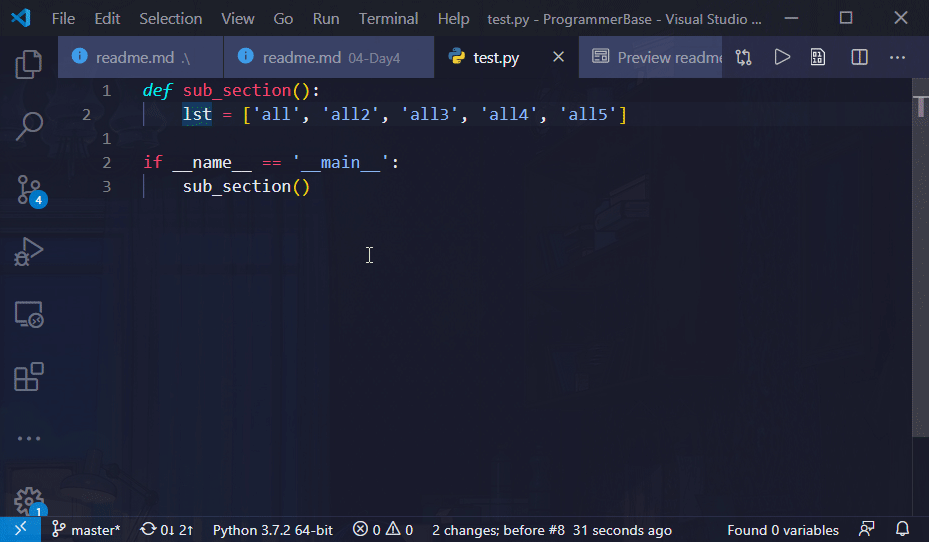
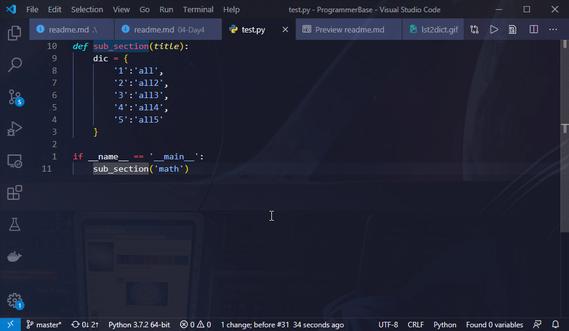
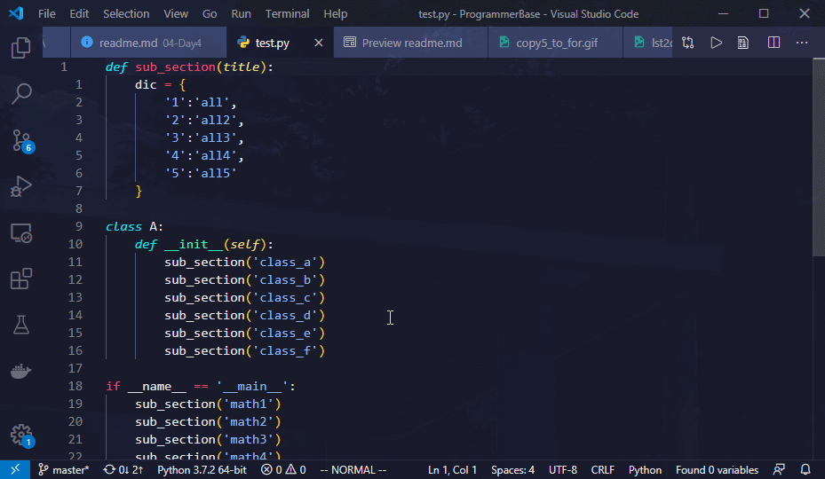
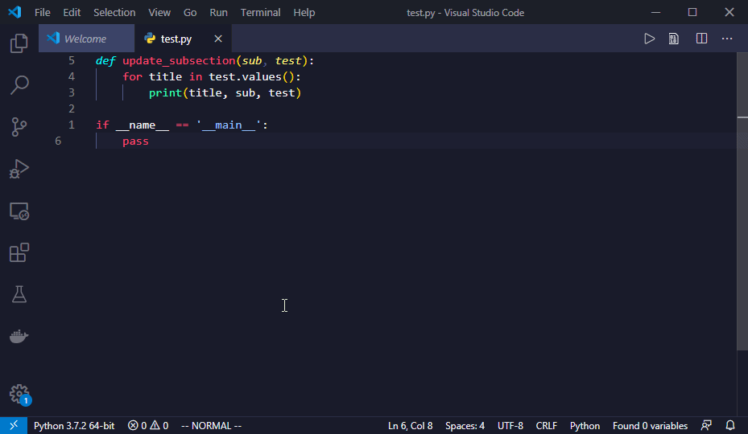
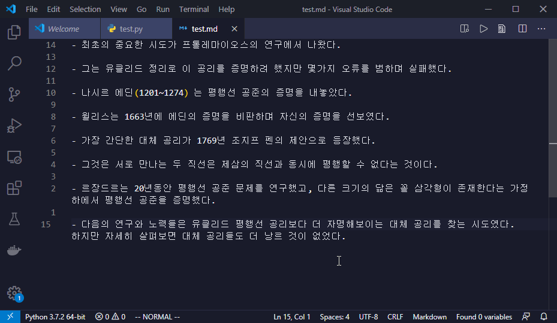
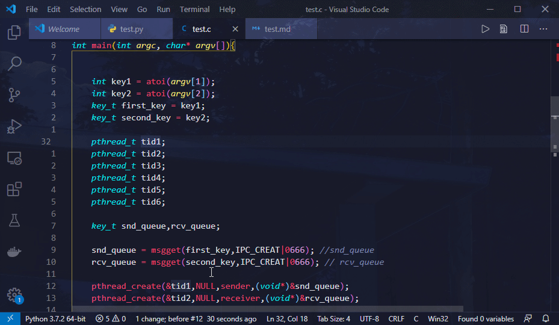
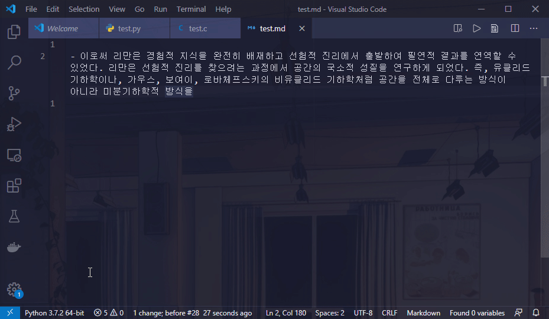
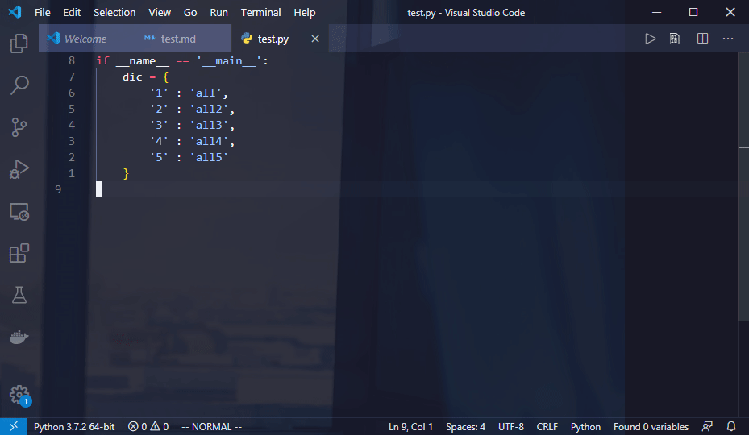
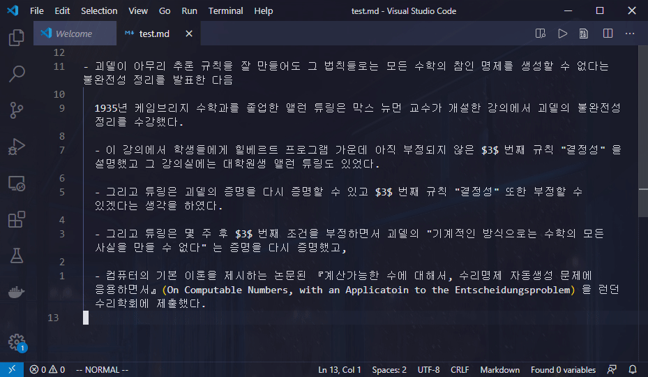

# Day 4 

GBC 첫번째 과정 **Programmer Base** 의 4일차 내용입니다.

---

# CLI

**CLI** 란 **Command Line Interface** 의 줄임말로써 말 그대로 터미널 인터페이스만 제공하는 프로그램을 뜻합니다. 반대로 **GUI**, 즉 **Graphic User Interface** 에는 우리가 이미 익숙해져 있습니다. 카카오톡, 배틀그라운드, 한컴, 파워포인트, `VSCode` 같은 게 전부 다 **GUI** 이기 때문이죠. 

여기에서는 다양한 **CLI** 들을 알아보고 지금까지 배웠던 몇몇 **CLI** 들은 업그레이드를 해보겠습니다.

---

# CLI 업그레이드하기

> 참고 : https://wiki.archlinux.org/index.php/Core_utilities#Alternatives

> +++ MIT 미싱 클래스 

여러분은 지금까지 리눅스 교재와 이곳의 내용들을 통해서 `bash` 쉘, `git`, `find`, `cat`, `ls`, `vim`, `tmux` 같은 CLI 툴을 알아보았습니다. 

지금부터 이 CLI 툴들을 사용하기 편리하도록 업그레이드 해보겠습니다.

## dotfiles

그러기 위해서 먼저 다음의 명령어들을 입력해서 각각의 툴들을 먼저 업그레이드 해야 합니다. 

```shell
$ sudo apt-get -y -qq install git zsh vim tmux unzip curl wget 
$ ZIPFILE="fd.deb"
$ VERSION=`curl -s https://github.com/sharkdp/fd/releases/latest | cut -d '"' -f 2 | cut -d '/' -f 8`
$ wget -q -O $ZIPFILE -q https://github.com/sharkdp/fd/releases/download/$VERSION/fd_${VERSION:1}_amd64.deb
$ sudo dpkg -i $ZIPFILE
$ DEBFILE="bat.deb"
$ VERSION=`curl -s https://github.com/sharkdp/bat/releases/latest | cut -d '"' -f 2 | cut -d '/' -f 8`
$ wget -q -O $DEBFILE -q https://github.com/sharkdp/bat/releases/download/$VERSION/bat_${VERSION:1}_amd64.deb
$ sudo dpkg -i $DEBFILE
$ DEBFILE="lsd.deb"
$ VERSION=`curl -s https://github.com/Peltoche/lsd/releases/latest | cut -d '"' -f 2 | cut -d '/' -f 8`
$ wget -q -O $DEBFILE -q https://github.com/Peltoche/lsd/releases/download/$VERSION/lsd_${VERSION}_amd64.deb
$ sudo dpkg -i $DEBFILE
$ wget -q "https://github.com/sharkdp/hexyl/releases/download/v0.6.0/hexyl_0.6.0_amd64.deb"
$ sudo dpkg -i hexyl_0.6.0_amd64.deb
$ wget -q -O install_ohmyzsh.sh https://raw.githubusercontent.com/ohmyzsh/ohmyzsh/master/tools/install.sh
$ sh install_ohmyzsh.sh --unattended
$ rm install_ohmyzsh.sh
$ git clone -q --recurse-submodules https://github.com/eendroroy/alien-minimal.git ~/.oh-my-zsh/custom/themes/alien-minimal
$ git clone -q https://github.com/zsh-users/zsh-autosuggestions ~/.oh-my-zsh/plugins/zsh-autosuggestions
$ curl -sfLo ~/.vim/autoload/onedark.vim --create-dirs https://raw.githubusercontent.com/joshdick/onedark.vim/master/autoload/onedark.vim
$ curl -sfLo ~/.vim/colors/onedark.vim --create-dirs https://raw.githubusercontent.com/joshdick/onedark.vim/master/colors/onedark.vim
$ curl -sfLo ~/.vim/autoload/plug.vim --create-dirs https://raw.githubusercontent.com/junegunn/vim-plug/master/plug.vim
$ vim +PlugInstall +qall
```

하지만 이 명령어들을 다 입력해야 한다니 정말 의욕이 사라지지 않나요? 그래서 제가 이것을 한 방에 설치할 수 있도록 쉘스크립트를 만들어두었습니다. 

이러한 CLI 툴들의 설치와 설정들을 매번 설치하기가 너무 귀찮아서 죽을 수도 있기 때문에 사람들은 `dotfiles` 라는 이름의 레포지토리에 일관적으로 정리해놓습니다. 

> 대표적으로 https://github.com/jessfraz/dotfiles, https://github.com/jessfraz/.vim 같은 레포지토리가 유명한 `dotfiles` 레포지토리입니다. 이렇게 개인적인 설정과 개인적인 CLI 툴 업그레이드를 만들어주어도, 사람들이 그것을 보고 사용하다가 편리하면 그냥 갖다 쓰기도 합니다. 

그럼 이제 다음 명령어를 통하여 저의 `dotfiles` 를 통해 CLI 들을 업그레이드해보겠습니다. 도커 컨테이너에 접속해서 진행해주세요. 

> 물론 여러분도 툴들을 사용하면서 개인적으로 업그레이드하고 싶은 부분이나 마음에 드는 설정을 `dotfiles` 레포지토리에 저장해놓을 수 있습니다.

##### **<div align="center"> ⬇ EXECUTE! ⬇ </div>**

```shell
$ git clone https://github.com/ccss17/dotfiles-cli
$ cd dotfiles-cli
$ ./install.sh
$ chsh -s /usr/bin/zsh    # 기본 쉘을 bash 에서 zsh 로 바꿉니다. 비밀번호를 물으면 당연히 "a" 를 입력하면 됩니다. 
```

그런 다음 명령어로 다시 도커 컨테이너에 접속해보세요. 

> 컨테이너 아이디 `e7bdf01c0acb` 는 다들 다를거에요.

##### **<div align="center"> ⬇ EXECUTE! ⬇ </div>**

```shell
$ exit
$ docker ps -a 
CONTAINER ID        IMAGE                      COMMAND                  CREATED              STATUS                     PORTS               NAMES
e7bdf01c0acb        ccss17/ubuntu              "/start.sh"              About a minute ago   Exited (0) 2 seconds ago                       hungry_albattani
$ docker start -ai e
```

그러면 더 이상 `bash` 가 아닌 `zsh` 쉘로 로그인 되고 모든 CLI 들과 설정들이 업그레이드된 환경이 자동으로 세팅되어 있습니다.

이제 어떻게 업그레이드 되었는지, 그리고 얼마나 편리해졌는지 하나씩 알아보겠습니다. 

## alias - 더 빨라진 명령 입력 

먼저 몇가지 `alias` 들을 설정함으로써 명령어를 입력하는 타자 횟수를 절약해봅시다. 설정된 `alias` 들은 `~/.zsh_aliases` 파일에 저장되어 있습니다. 그리고 `~/.zsh_aliases` 는 `~/.zshrc` 의 

```shell
source ~/.zsh_aliases
```

로써 적용됩니다. `.zshrc` 는 `bash` 가 실행될 때 `.bashrc` 를 실행하는 것처럼 `zsh` 이 실행될 때 실행시키는 명령어들을 모아둔 설정 파일입니다. 

- `~/.zsh_aliases` 파일에 

  ```shell
  alias clear=c
  ``` 

  를 설정해두어서 `clear` 를 매번 누르지 않고 `c` 만 눌러도 되게끔 할 수 있습니다. 하지만 개인적으로 다음의 `alias` 를 훨씬 더 많이 쓰게 되는데 

  ```shell
  alias cl='clear;ls'
  ``` 

  `clear` 를 하고 `ls` 를 실행함으로써 파일 목록을 바로 볼 수 있기 때문이죠. 다음을 실행하여 실제로 확인해보세요. 

  ##### **<div align="center"> ⬇ EXECUTE! ⬇ </div>**

  ```shell
  $ c
  $ cl
  ```

  > 이로써 만약 여러분이 살아가는 전체 시간동안 `clear` 명령어를 **1만** 번 실행시킨다고 가정한다면 **10000 * 5 = 5만** 번 키보드를 입력해야 하는 것을 **10000 * 1 = 1만** 번으로 절약하여 **4만 번의 타수를 절약**했습니다. 

이러한 `alias` 들을 자기 입맛대로 설정하여 긴 명령어를 단축해서 누를 수 있습니다. 그렇게 제가 저의 입맛대로 설정한 `alias` 들의 목록이 다음과 같습니다.

<div align="center">

|`alias`|`command`|
|:---|:---|
|`t`|`tmux`|
|`v`|`vim`|
|`c`|`clear`|
|`cs`|`cd ..`|
|`ls`|`lsd --icon never`|
|`cl`|`clear;ls`|
|`l`|`ls`|
|`la`|`ls -a`|
|`ll`|`ls -la`|
|`lt`|`ls --tree`|
|`g`|`git`|
|`q`|`exit`|

</div>

실제로 위 표의 `alias` 들이 `~/.zsh_aliases` 에 설정되어 있고 도커 컨테이너에서 실행해볼 수 있습니다. 

특히 `alias ls=lsd` 로 `ls` 가 `lsd` 로 바꾼 것을 알 수 있습니다. 더 이상 `ls` 자체를 사용하지 않고 `ls` 를 입력하면 `lsd` 라는 프로그램이 실행되도록 한 것입니다.

> `lsd` 가 어떤 프로그램이길래 원래 있던 `ls` 를 버리고 `lsd` 를 쓰는지는 아래에서 설명합니다. 

> `lsd --icon never` 의 `--icon never` 옵션은 단지 아이콘이 출력되지 않도록 하는 옵션이므로 신경 쓰지 않아도 됩니다. 

이렇게 `ls` 가 `lsd` 로 치환되기 때문에 

**`alias l=ls` 로 `l` 을 입력하면 `lsd` 로 치환되고**

**`alias ll=ls -la` 로 `ll` 을 입력하면 `lsd -la` 로 바뀝**니다. 

## `ls` ➜ `lsd`

**[`lsd`](https://github.com/Peltoche/lsd)** 는 구식인 `ls` 명령어를 최신식으로 대체한 프로그램입니다. `vim` 을 연습할 때 사용했던 `lolcat` 의 디렉토리로 이동해서 다음 명령어로 `ls` 와 `lsd` 를 비교하며 실행해보세요. 

##### **<div align="center"> ⬇ EXECUTE! ⬇ </div>**

```shell
$ /bin/ls
$ l
$ /bin/ls -al
$ ll
```

그러면 실행결과가 다음과 같을 겁니다.

<div align="center">

</div>


이렇게 컬러풀하게 출력결과를 보여줘서 가독성이 훨씬 올려줍니다. 

> `lsd --icon never` 에서 `--icon never` 옵션이 아이콘을 출력하지 않는 옵션이라고 했습니다. 이는 CLI 환경에서 필요한 옵션이기 때문에 만약 **macOS** 나 리눅스 데스크탑 환경에서 `--icon never` 옵션을 제거하고 `lsd` 를 실행하면 다음과 같이 아이콘도 함께 출력되어 가독성이 훨씬 올라가는 것을 알 수 있습니다. 

<div align="center">

</div>

## `cat` ➜ `bat`

**[`bat`](https://github.com/Peltoche/lsd)** 는 구식인 `cat` 명령어를 최신식으로 대체한 프로그램입니다. 그럼 `cat` 와 `bat` 를 비교해봅시다. `vim` 때 `clone` 해놨던 `lolcat` 디렉토리로 가서 실습해주세요. 

##### **<div align="center"> ⬇ EXECUTE! ⬇ </div>**

```shell
$ cat Makefile
$ bat Makefile
```

`cat` 이 다음과 같이 밋밋하게 출력되는 반면,

<div align="center">

</div>


`bat` 이 다음과 같이 컬러풀하게 출력됩니다. 

<div align="center">

</div>

`bat` 으로 `lolcat.c` 같은 `C` 언어 소스코드도 출력해보세요. 

> `bat` 은 `more` 이나 `less` 처럼 <kbd>e</kbd> 와 <kbd>y</kbd> 를 누르면 위아래로 움직일 수 있고 <kbd>Spacebar</kbd> 와 <kbd>u</kbd> 를 누르면 페이지 단위로 위아래로 이동할 수 있으며 `vim` 처럼 `/` 로 특정 문자열을 검색할 수 있고 `q` 로 종료할 수 있습니다. 

##### **<div align="center"> ⬇ EXECUTE! ⬇ </div>**

```shell
$ bat lolcat.c
```

## `xxd` ➜ `hexyl`

**[`hexyl`](https://github.com/sharkdp/hexyl)** 는 구식인 `xxd` 명령어를 최신식으로 대체한 프로그램입니다. `xxd` 가 리눅스 교재에서 설명되어있는지 잘 모르겠지만, 어쨌든 파일의 데이터를 헥사값으로 보여주는 프로그램인 것만 알면 됩니다. 그럼 `xxd` 와 `heyyl` 를 비교해봅시다. 

> 텍스트 파일보다는 바이너리 파일의 헥사값을 보는 것이 유의미하기 때문에 이미 컴파일이 된 `lolcat` 을 살펴보겠습니다. 

```shell
$ xxd lolcat 
$ hexyl lolcat 
```

하지만 파일 크기가 너무 커서 앞부분을 제대로 보지 못하니 `less` 로 출력을 디라이렉트해보겠습니다. 

##### **<div align="center"> ⬇ EXECUTE! ⬇ </div>**

```shell
$ xxd lolcat | less
$ hexyl lolcat | less
```

`less` 도 `bat` 처럼 <kbd>e</kbd> 와 <kbd>y</kbd> 로 위아래로 움직일 수 있고 <kbd>Spacebar</kbd> 와 <kbd>u</kbd> 로 페이지 단위로 위아래로 이동할 수 있으며 `q` 로 종료할 수 있습니다. 

`xxd` 와 `hexyl` 의 실행결과는 다음과 같습니다. 

<div align="center">

</div>

## `find` ➜ `fd`

**[`fd`](https://github.com/sharkdp/fd)** 는 구식인 `find` 명령어를 최신식으로 대체한 프로그램입니다. `find` 를 리눅스 교재에서 어느정도 연습하셨을 거라고 생각합니다. `fd` 는 `find` 보다 **5배** 정도 빠르고 좀 더 유저들이 사용하기 편하도록 인터페이스가 대폭 개선된 모던한 프로그램입니다. 

`fd` 는 `find` 와 상세하게 비교하기보다 다음의 사용예를 가볍게 한번 살펴보는 것으로 마무리하겠습니다. 

<div align="center">

</div>

`fd` 의 상세한 설명을 알고 싶다면 공식 레포지토리 https://github.com/sharkdp/fd 를 참고해주세요.

## `top` ➜ `htop` ➜ `gotop`

기존의 `top` 은 다음과 같이 약간은 밋밋하게 시스템의 상태를 출력해주었습니다.

<div align="center">

</div>

하지만 [`htop`](https://github.com/hishamhm/htop) 은 다음과 같이 색깔도 칠하고 메모리와 CPU 상태를 핸드폰 배터리 바처럼 보여줍니다. 

<div align="center">

</div>

마지막으로 [`gotop`](https://github.com/cjbassi/gotop) 은 다음과 같이 완벽한 그래프로 시스템의 상태를 직관적으로 출력해줍니다.

<div align="center">

</div>

도커 컨테이너에도 `gotop` 이 이미 설치되어 있으니 시험삼아 실행해보세요.

##### **<div align="center"> ⬇ EXECUTE! ⬇ </div>**

```shell
$ gotop
```

시스템 상태를 출력해줄 수 있는 유틸리티는 개인적인 선호에 따라 좋고 나쁨이 결정되므로 확실히 어떤 게 좋다라고 말할 수 없습니다. 따라서 그냥 개인적으로 더 나은 것 같은 CLI 를 사용하면 됩니다. 

> 전 개인적으로 `gotop` 이 직관적이고 좋더라구요. 

## `man` ➜ `tldr` 

`man` 은 명령어의 사용법을 출력하는 매우 좋은 프로그램입니다. 하지만 `man` 의 한 가지 단점은 그 사용법이 너무 방대하고 장황하다는 것입니다. 그래서 프로그램의 핵심 사용법을 쉽고 빠르게 알고 싶은 사용자들은 그 방대한 사용법에서 자신이 원하는 핵심 사용법을 이리저리 찾고 있어야만 했습니다. 

하지만 [`tldr`](https://github.com/tldr-pages/tldr) 은 `man` 처럼 방대한 사용법을 보여주는 것이 아니라 매우 간단한 핵심 사용법만을 알려줍니다. `tldr` 은 사용자들의 주도로 만들어져서 개발자들이 경험적으로 **"이게 가장 핵심적인 사용법이다!"** 라는 사용법만 간단하게 출력합니다.

- 실습 

  `tar` 명령어는 파일과 디렉토리를 압축할 수 있는 좋은 명령어지만 여러가지 옵션이 약간 복잡해서 기억하기 힘들 때가 있습니다. 그럴 때는 다음 명령어를 통해 `tar` 의 사용법을 확인해야 합니다. 

  ##### **<div align="center"> ⬇ EXECUTE! ⬇ </div>**

  ```shell
  $ man tar
  ```

  그러면 다음과 같이 `tar` 의 **모든 사용법** 이 출력됩니다. 

  <div align="center">
  
  </div>

  이런... 하지만 `man` 으로 `tar` 를 보니 설명이 매우 방대하고 매우 연역적으로, 그러니까 약간은 추상적으로 설명되어 있습니다. 그렇다면 다음 명령어를 실행하여 `tldr` 로 `tar` 의 사용법을 보겠습니다. 

  ##### **<div align="center"> ⬇ EXECUTE! ⬇ </div>**

  ```shell
  $ tldr tar
  ```

  그러면 다음과 같이 개발자들이 자주 사용하는 `tar` 의 핵심 기능들이 약간 귀납적으로, 즉 상당히 구체적으로 설명된 사용법이 출력됩니다. 

  <div align="center">
  
  </div>

# 더 빨라진 git

`git` 은 지원하는 지능이 하도 많다보니 내부적으로 `alias` 를 지원합니다. 가령 `git commit -m` 이라는 명령어를 매번 입력하기가 너무 귀찮아서 견딜 수가 없으니까 다음 명령어를 입력하여 `alias` 를 지정할 수 있습니다. 

##### **<div align="center"> ⬇ EXECUTE! ⬇ </div>**

```shell
$ g config --global alias.cm "commit -m"
```

> `zsh` 의 `alias` 에서 `alias g=git` 으로 `git` 의 에일리어스 `g` 를 설정했었기 때문에 `git` 이 아닌 `g` 만 입력해도 됩니다. 

그러면 이제부터 우리는 `git commit -m` 이 아니라 `g cm` 만 입력해도 되는 것입니다. 그런데 저의 `dotfiles` 를 설치하면서 이런 `git` 의 `alias` 들이 이미 `~/.gitconfig` 파일에 많이 설정되었습니다. 이 내용들을 확인하고 싶다면 

```shell
$ bat ~/.gitconfig
```

를 실행해보면 됩니다. `git` 의 `alias` 가 매우 많이 설정되어 있지만 그중에서 주요한 `alias` 들은 다음과 같습니다. 

<div align="center">

|`alias`|원래 명령어|완성된 명령어|의미|
|:---|:---|:---|:---|
|`i`|`init`|`g i`|`git` 레포지토리 관리를 시작하도록 한다.|
|`s`|`status`|`g s`|레포지토리 상태를 본다.|
|`sb`|`status -s -b`|`g sb`|레포지토리 상태를 간략하게 본다.|
|`cm`|`commit -m`|`g cm "<MESSAGE>"`|커밋을 한다.|
|`a`|`add --all`|`g a`|추가되거나 변경된 파일을 스테이징 한다.|
|`l`|`log --oneline`|`g l`|`git` 의 커밋 기록을 한줄씩 출력한다.|
|`lg`|`log --oneline --graph --decorate`|`g lg`|`git` 의 커밋 기록을 그래프로 출력한다.|
|`rao`|`remote add origin`|`g rao <REMOTE>`|원격 레포지토리를 추가한다.|
|`cl`|`clone`|`g cl <URL>`|원격 레포지토리를 복제해 온다.|
|`psom`|`push origin master`|`g psom`|원격 레포지토리로 푸쉬한다.|
|`plom`|`pull origin master`|`g plom`|원격 레포지토리를 가져온다.|
|`b`|`branch`|`g b <BRANCH>`|브랜치를 생성한다.|
|`bd`|`branch -d`|`g bd <BRANCH>`|브랜치를 삭제한다.|
|`m`|`merge`|`g m`|작업이 완료된 브랜치를 병합한다.|
|`o`|`checkout`|`g o <BRANCH>`|브랜치로 이동한다.|
|`ob`|`checkout -b`|`g ob <BRANCH>`|브랜치를 생성함과 동시에 이동한다.|

</div>

우리는 **2번째 날** `git` 을 연습할 때 `git-test` 디렉토리를 생성하고 그곳에서 여러가지 작업을 했습니다. 그때 입력한 명령어들을 쭉 나열해보면 다음과 같습니다. 

```shell
$ mkdir git-test
$ cd git-test
$ git init
$ touch test.txt
$ git status
$ git add test.txt
$ git status
$ git commit -m "my first commit"
$ git status
$ echo "My test memo" > test.txt
$ cat test.txt
My test memo
$ git add .
$ git commit -m "My memo file"
$ git log
$ git remote add origin https://github.com/<USER>/git-test
$ git push -u origin master
$ cd  
$ git clone https://github.com/<USER>/git-test git-test-remote
$ cd git-test-remote
$ echo "very important message" > test.txt
$ git add .
$ git commit -m "very important file.."
$ git push origin master
$ cd ~/git-test
$ cat test.txt
$ git pull origin master
$ cat test.txt
```

이제 새로운 레포지토리 `alias-test` 를 만들고 위 명령어들을 `alias` 로 단축해서 다시 입력해보겠습니다. 다음 명령어를 실행해보세요. 하지만 걱정하지마세요. `alias` 덕분에 생각보다 오래 안걸리니까요.

##### **<div align="center"> ⬇ EXECUTE! ⬇ </div>**

```shell
$ cd
$ mkdir alias-test
$ cd alias-test
$ g i
$ touch test.txt
$ g s
$ g a
$ g s
$ g cm "init"
$ g s
$ echo "My test memo" > test.txt
$ bat test.txt
$ g a
$ g cm "memo"
$ g l
$ g rao https://github.com/<USER>/alias-test
$ g psom
$ cd  
$ g cl https://github.com/<USER>/alias-test alias-test-remote
$ cd alias-test-remote
$ echo "message" > test.txt
$ g a
$ g cm "important file"
$ g psom
$ cd ~/alias-test
$ bat test.txt
$ g plom
$ bat test.txt
```

이로써 다음과 같이 `213` 타를 쳐야 했던 것을 `79` 타만 칠 수 있도록 대폭 절약을 해보았습니다.

<div align="center">

|원래 명령어|`alias` 명령어|
|:---|:---|
|`git init`|`g i`|
|`git status`|`g s`|
|`git add`|`g a`|
|`git status`|`g s`|
|`git commit -m`|`g cm `|
|`git status`|`g s`|
|`git add .`|`g a`|
|`git commit -m`|`g cm`|
|`git log`|`g l`|
|`git remote add`|`g rao`|
|`git push -u origin master`|`g psom`|
|`git clone`|`g cl`|
|`git add .`|`g a`|
|`git commit`|`g cm`|
|`git push origin master`|`g psom`|
|`git pull origin master`|`g plom`|
|**총합 `213` 개**|**총합 `79` 개**|

</div>

이러한 `git` 레포지토리 관리 패턴은 코딩을 할 때마다 반복되는데, 이 패턴을 개발자로 살아가면서 적게 잡아서 **10000** 번 반복한다고 한다면, 여러분은 **10000 * 213 = 2백 13만** 번 칠 것을 **10000 * 79 = 79만** 만쳤습니다. 

즉, 똑같은 일을 하는데 **134만** 번의 타자를 안 친것입니다!

# `bash` ➜ `zsh` - 더 빨라진 쉘

`zsh` 은 수많은 플러그인과 테마가 지원되는 쉘입니다. 이제 `bash` 쉘을 그만 쓰고 `zsh` 을 사용해보겠습니다.

> `zsh` 의 기능이 하도 많아서 `zsh` 를 사용하는 저도 기능의 반의 반도 알지 못하지만 다시는 `bash` 를 쓸 수 없는 몸이 되버렸습니다. `zsh` 이 너무 편하기 때문이죠. 

> 2019년에 출시된 **macOS Catalina**에서도 `bash` 를 버리고 `zsh` 을 기본쉘로 채택했다니까 맥유저들은 `zsh` 기능을 알면 더욱 좋겠네요. 

> `zsh` 말고도 [**`fish`**](https://fishshell.com/) 쉘도 많이 쓰입니다. 

`zsh` 은 `oh-my-zsh` 을 설치해야만 그 진가를 발휘하는데, 여러분의 도커 컨테이너에는 `dotfiles` 을 설치 할 때 `zsh` 과 `oh-my-zsh` 이 다 설치되어 있으니까 걱정하지 마세요. 

> 설치법도 다 알아보아야 하지만, `5` 일이라는 매우 제한적인 시간 때문에 부득이하게 설치법은 전부 다 생략했습니다. 설치법이 궁금하다면 **Google** 에 검색해서 공식 레포지토리들을 방문해보면 됩니다. 

## 테마

`zsh` 은 정말 수많은 테마를 갖고 있습니다.

> https://github.com/ohmyzsh/ohmyzsh/wiki/External-themes 에 들어가서 마음에 드는 테마가 있는지 볼 수 있어요. 

현재 도커 컨테이너에 설치되어 있는 `zsh` 테마는 다음과 같은 [alien-minimal](https://github.com/eendroroy/alien-minimal) 입니다.

[](https://asciinema.org/a/264037)

`zsh` 테마는 단순히 `bash` 쉘 프롬프트보다 더 멋있기 때문에 사용해야 하는 것도 있지만 수많은 기능들도 제공하기 때문에 사용해야 합니다. 그 수많은 기능 중 다음 두 가지 기능만 알아보겠습니다. 

- `git` 브랜치를 프롬프트에 보여준다. 

  

  - 위와 같이 프롬프트 우측에 `master` 가 `dev` 로 바뀌고 다시 `master`로 바뀌었습니다.

  - 이렇게 `git` 으로 레포지토리를 관리하다가 실험적인 기능을 테스트해야 해서 새로운 `branch` 인 `dev` 를 만들고 이주했을 때, `zsh` 의 프롬프트가 우측에 현재 상주하고 있는 `branch` 정보를 알려줍니다. 

  - 그래서 매번 `git branch` 를 입력하여 현재 상주하고 있는 `branch` 가 어떤 건지 확인할 필요가 없습니다.

- 프로그램의 리턴값이 정상값 `0` 이 아닐경우 프롬프트에 보여준다. 

  

  - 위와 같이 `ls` 명령어를 입력하면 정상 종료 코드 `0` 가 반환되지만 존재하지 않는 명령어 `lss` 가 입력되면 비정상 종료 코드 `127` 이 반환됩니다. 

  - `zsh` 프롬프트는 그러한 비정상 종료 코드를 보여주고 프로그램이 비정상적으로 종료되었을 때 프롬프트 색깔을 다른 색깔로 바꿔줍니다. 

## `tab-completion` 기능

이 기능은 명령어의 부분만 입력하고 <kbd>Tab</kbd> 을 눌렀을 때 `zsh` 이 알아서 명령어를 추천해주는 기능입니다. 

- 다음과 같이 `cd` 만 누르고 <kbd>Tab</kbd> 을 누르면 명령어를 추천을 해주고, `cd` 를 선택하고 다시 <kbd>Tab</kbd> 을 누르니까 이동할 레포지토리를 추천해줍니다. 우리가 해야 할 일은 단지 <kbd>Enter</kbd> 를 누르는 것 뿐이죠. 

  

- 다음과 같이 특정 디렉토리만 입력하고 나서 <kbd>Tab</kbd> 을 누르면 하위 디렉토리를 추천해줍니다. 

  

## `auto-completion` 기능

이 기능은 사용자가 길고 복잡한 경로를 이동해야 할때 그것을 특정할 수 있는 문자만 입력하고 <kbd>Tab</kbd> 을 누르면 자동으로 완성해주는 `zsh` 의 기능입니다. 

- `/usr/lib/gcc/x86_64-linux-gnu/9.3.0` 의 경로로 이동해야 하는 경우라고 가정하겠습니다.

  ```shell
  $ cd /usr/lib/gcc/x86_64-linux-gnu/9.3.0
  ```

  하지만 이건 너무 길어서 짜증나서 견딜 수가 없습니다. 그러니까 다음 명령어만 입력하고 <kbd>Tab</kbd> 을 누릅니다. 

  ```shell
  $ cd /u/l/g/x/9
  ```

  그러면 다음과 같이 `zsh` 이 경로를 지가 알아서 완성시켜 줍니다. 

  

## `z` 명령어 

`z` 명령어는 사용자가 자주 이동하는 디렉토리 경로의 통계를 내어서 사용자가 이동하는 경로를 특정할 수 있는 짧은 경로만 입력해도 이동할 수 있게끔 해주는 **너무너무 편리**한 `zsh` 플러그인입니다. 

단 `z` 명령어를 사용하기 위해서는 반드시 한 번 이상은 그 경로로 이동한 적이 있어야 합니다. 왜냐하면 `z` 이 사용자가 이동한 경로를 분석하고 통계를 낼 기회를 줘야하기 때문이죠.

- 방금 전에 `/usr/lib/gcc/x86_64-linux-gnu/9.3.0` 라는 경로로 이동했었으니까 이 경로를 아마도 `9` 이 특정할 수 있을 것 같으니까 다음 명령어를 실행해봅니다. 

  ```shell
  $ z 9
  ```

  실행 결과는 다음과 같습니다. 

  

- 또 우리는 `lolcat` 디렉토리를 왔다갔다 거렸습니다. 아마도 `lol` 로 이 디렉토리 경로를 특정할 수 있을 것 같네요. 그러면 다음 명령어를 입력해보세요. 

  ##### **<div align="center"> ⬇ EXECUTE! ⬇ </div>**

  ```shell
  $ z lol
  ```

## `auto-suggestions` 기능

이 기능은 가장 최근에 실행한 명령어를 기억하여 사용자가 그 명령어와 비슷한 타자를 친다면 자동으로 완성된 명령어를 추천해주는 `zsh` 플러그인입니다. 이 기능은 긴 명령어를 반복해야 할 때 **너무 편합**니다.

사용법도 매우 간단합니다. 명령어를 입력하다 보면 `auto-suggestions` 이 희미한 글씨로 완성된 명령어를 추천하는데 그것을 실행하길 원했다면 <kbd>&rarr;</kbd> 를 눌러서 명령어를 완성시키면 됩니다.

만약 `auto-suggestions` 이 추천한 명령어 전부를 원하지 않고 부분적인 것만 원한다면 <kbd>Ctrl</kbd>+<kbd>&rarr;</kbd> 를 누르면 됩니다. 

- 이 **GBC** 과정을 만드느라 저는 도커 컨테이너를 여러번 종료했다가 재시작했어야만 했는데 그럴때마다 `docker start -ai b` 명령어를 반복적으로 입력했어야 했습니다.

  하지만 다음과 같이 `auto-suggestions` 이 반복되는 명령어를 추천해주기 때문에 매번 입력할 필요 없이 `d` 만 누르고 <kbd>&rarr;</kbd> 를 누르면 됩니다.
  
  `docker start -ai b` 을 일일이 다 입력해야 하는 것과 비교해봅니다.
  
  

  > `q` 명령어는 `alias` 파트에서 `alias q=exit` 라고 정의된 것을 확인했었습니다.

# 더 빨라진 tmux

`tmux` 업그레이드는 사실 실제적인 업그레이드가 아니라 `tmux` 의 설정을 커스터마이징할 수 있는 `~/.tmux.conf` 파일에 사용자가 더 편하게 사용할 수 있도록 설정을 조작하는 것입니다. 그렇기 때문에 여기에서는 제가 설정한 `~/.tmux.conf` 파일을 중심으로 `tmux` 를 사용하기가 얼마나 편해졌는지 살펴보겠습니다. 

## 더 빨라진 alias

먼저 `tmux` 라는 명령어를 매번 치는 것은 너무 비효율적입니다. 무려 `4` 번이나 키보드를 쳐야하기 때문이죠. 그래서 `~/.zsh_aliases` 에 

```shell
alias t=tmux
```

를 추가하여 `t` 만 눌러도 `tmux` 가 켜지도록 합니다. 

- 실습 

  도커 컨테이너에서 다음 명령어로 `tmux` 를 켰다가 꺼보세요. 

  ```shell
  $ t
  $ q
  ```

  

## 더 이뻐진 테마 

`tmux` 의 오리지널 테마는 너무 안이쁘네요. 그래서 좀 더 가독성도 높아지고 보기에도 좋고 시간도 알 수 있도록 다음과 같은 설정으로 테마를 고칩니다.

```shell
set -g status-bg default
set -g status-fg colour137
set -g status-style dim
set -g status-left '#[fg=colour51,bg=colour0,bold] %R '
# set -g status-right '#[fg=colour51,bg=colour0,bold] #(uname -r) '
set -g status-right '#[fg=colour51,bg=colour0,bold] #(osname) '
set -g status-right-length 100
setw -g window-status-current-style bg=colour14,fg=colour00,bold
setw -g window-status-current-format ' #I#[fg=colour0] #[fg=colour0]#W#[fg=colour0] '
setw -g window-status-style fg=colour49,none,bg=colour00
setw -g window-status-format '#I #W '
setw -g window-status-bell-style fg=colour255,bold,bg=colour1
set -g message-style fg=colour232,bold,bg=colour16
```

이 설정들은 `~/.tmux.conf` 에 있는데 그 의미를 상세히는 몰라도 됩니다. 

- 다음은 테마를 설정하기 전의 오리지널 `tmux` 의 테마입니다. 상태바가 아래쪽에 있고, 새 화면을 만들었지만 한 눈에 들어오지가 않습니다. 오른쪽에 시간도 표시되는데 역시 한 눈에 들어오지 않네요. 

  

- 하지만 다음과 같이 테마를 바꿔서 가독성을 확연히 높혔습니다. 상태바가 위로 올라갔고, 왼쪽에는 시간이 간략하지만 눈에 확 들어오게 보입니다. 

  

  그리고 `0` 번째 화면에는 `zsh` 이 켜져있고, `1` 번째 화면에는 `vim` 이 켜져있는데 현재 상주하고 있는 화면에 하이라이팅이 되서 가독성이 매우 높아집니다. 오른쪽에는 운영체제의 이름도 나타납니다.

## 더 빨라진 메타 키

| 기능 | 기존 단축키 | 새로운 단축키 |
|:---:|:---:|:---:|
| **Meta** 키 | <kbd>Ctrl</kbd>+<kbd>b</kbd>  |<kbd>Ctrl</kbd>+<kbd>a</kbd>  |

`tmux` 는 **Meta** 키 를 사용하여 명령어들을 정의하기 때문에 <kbd>Ctrl</kbd>+<kbd>b</kbd> 를 입력했어야 했습니다. 하지만 <kbd>Ctrl</kbd> 와 <kbd>b</kbd> 는 거리가 너무 멀어서 손이 아픕니다. 그래서 `~/.tmux.conf` 에 

```shell
unbind C-b
set-option -g prefix C-a
bind-key C-a send-prefix
```

를 추가하여 거리가 가까운 <kbd>Ctrl</kbd>+<kbd>a</kbd> 로 **Meta** 키를 재설정합니다. 여러분의 도커 컨테이너에는 이미 설정 되어있으니 걱정하지 마세요.

> 앞으로 살펴볼 `tmux` 업그레이드들도 위와 같은 설정 파일을 조작하는 것으로 이루어졌지만, 일일이 어떤 설정으로 `tmux` 가 업그레이드되었는지 상세히 설명하지는 않겠습니다. 

## 더 빨라진 터미널 분할 

| 기능 | 기존 단축키 |새로운 단축키 |
|:---:|:---:|:---:|
| 터미널 수직 분할 | <kbd>Meta</kbd>+<kbd>%</kbd>  |<kbd>Meta</kbd>+<kbd>⧵</kbd>  |
| 터미널 수평 분할 | <kbd>Meta</kbd>+<kbd>"</kbd>  |<kbd>Meta</kbd>+<kbd>-</kbd>  |
| 다음 터미널으로 이동 | <kbd>Meta</kbd>+<kbd>o</kbd>  | <kbd>Alt</kbd>+<kbd>o</kbd> |
| (숫자) 터미널으로 이동 | <kbd>Meta</kbd>+<kbd>q</kbd> + (숫자)  |

`tmux` 에서 터미널을 수평으로 분할하려면 기존의 명령어 <kbd>Meta</kbd>+ <kbd>"</kbd> 를 입력해야 하는데 이건 외우기가 너무 어렵습니다. 그래서 외우기 쉽도록 수평으로 나눈다는 의미에서 <kbd>Meta</kbd>+ <kbd>-</kbd> 로 직관적으로 바꿉니다. 

또한 터미널을 수직으로 분할하려면 기존의 명령어 <kbd>Meta</kbd>+ <kbd>%</kbd> 를 입력해야 하는데 이것 역시 외우기가 너무 어렵습니다. 그래서 외우기 쉽도록 수직으로 나눈다는 의미에서 백슬래쉬로 바꿔서 <kbd>Meta</kbd>+ <kbd>⧵</kbd> 로 직관적인 단축키를 설정합니다. 

그리고 다음 터미널로 이동하는 단축키 <kbd>Meta</kbd>+<kbd>o</kbd> 는 실제로 (<kbd>Ctrl</kbd>+<kbd>a</kbd>) + <kbd>o</kbd> 인데, 다음 터미널로 이동하는 작업은 매우 많이 일어나므로 키를 `3` 번이나 눌러야 하는 것은 너무 비효율적이어서 참을 수가 없습니다. 그래서 <kbd>Alt</kbd>+<kbd>o</kbd> 로 바꿉니다. 

**유일하게 MacOS 에서만 테스트를 못해봤기 때문에 MacOS 에서는 <kbd>Alt</kbd> 키로 하는 것이 안될 수도 있습니다. 그럴경우 그냥 <kbd>Meta</kbd> + <kbd>o</kbd> 로 하면 될 겁니다. 맥에서 <kbd>Alt</kbd> 가 어떻게 입력되는지 아시는 분이 있다면 알려주세요. 아마도 맥에서 "option" 이라는 키가 <kbd>Alt</kbd> 의 기능을 하지 않을까 싶습니다.**

- 실습 

  다음과 같이 터미널을 수직, 수평으로 여러번 분할해보고 <kbd>Alt</kbd> 를 계속 누른 채로 <kbd>o</kbd> 를 눌러서 터미널을 이동해보세요. 

  

  터미널 이동이 정말 빨라졌습니다. 

## 더 빨라진 화면 생성 

| 기능 | 기존 단축키 | 새로운 단축키 |
|:---:|:---:|:---:|
| 새로운 화면 생성 | <kbd>Meta</kbd>+<kbd>c</kbd>  | <kbd>Alt</kbd>+<kbd>c</kbd>|
| 다음 화면으로 이동 | <kbd>Meta</kbd>+<kbd>n</kbd>  |<kbd>Alt</kbd>+<kbd>n</kbd>|
| 이전 화면으로 이동 | <kbd>Meta</kbd>+<kbd>p</kbd>  |<kbd>Alt</kbd>+<kbd>p</kbd>|

새로운 화면을 생성하고 화면을 넘기는 일도 편하게 하기 위하여 <kbd>Meta</kbd> 키 대신 <kbd>Alt</kbd> 를 사용합시다. 메타키를 <kbd>Alt</kbd> 키로 바꾸는 것만으로 얼마나 작업이 빨라지는지 보세요. 

- 실습 

  다음과 같이 <kbd>Alt</kbd> 를 계속 누른채로 <kbd>c</kbd> 를 연타해서 화면을 더욱 빠르게 만들 수 있습니다. 그리고 여러 화면을 마찬가지로 <kbd>Alt</kbd> 를 계속 누른채로 <kbd>n</kbd> 또는 <kbd>p</kbd> 를 누르면서 이동해보세요. 

  

## 더 빨라진 터미널 이동

| 기능 | 기존 단축키 | 새로운 단축키 |
|:---:|:---:|:---:|
| 왼쪽 터미널으로 이동 | (기억이 안남..)  | <kbd>Alt</kbd>+<kbd>h</kbd>|
| 오른쪽 터미널으로 이동 | (기억이 안남..)  | <kbd>Alt</kbd>+<kbd>l</kbd>|
| 위쪽 터미널으로 이동 | (기억이 안남..)  | <kbd>Alt</kbd>+<kbd>k</kbd>|
| 아래쪽 터미널으로 이동 | (기억이 안남..)  | <kbd>Alt</kbd>+<kbd>j</kbd>|

터미널 이동을 <kbd>Alt</kbd>+<kbd>o</kbd> 로 매우 빠르게 할 수 있게 되었지만서도 터미널이 여러개로 나뉘었을 때 <kbd>Alt</kbd>+<kbd>o</kbd> 로 다음 터미널로밖에 이동할 수 없다면, 정확히 원하는 터미널로 이동할 수 없습니다. 이런 경우를 위하여 `tmux` 는 정확히 왼쪽, 오른쪽, 위쪽, 아래쪽 터미널로 이동할 수 있는 명령어를 제공합니다. 

하지만 그건 너무 복잡했었고 그게 뭐였는지 솔직히 까먹었습니다. 그 대신 `vim` 에서의 커서 이동키였던 <kbd>h</kbd>, <kbd>l</kbd>, <kbd>k</kbd>, <kbd>j</kbd> 에서 착안하여 터미널 이동을 매우 쉽게 할 수 있습니다. 

- 실습 

  다음과 같이 터미널을 여러개로 분할하고 <kbd>Alt</kbd> 를 누른채로 <kbd>h</kbd>, <kbd>l</kbd>, <kbd>k</kbd>, <kbd>j</kbd> 를 누르면서 터미널을 이동해보세요. 

  

## 더 빨라진 터미널 크기 조절

| 기능 | 기존 단축키 | 새로운 단축키 |
|:---:|:---:|:---:|
| 터미널 크기를 왼쪽으로 방향으로 조절 | (너무 복잡함) | <kbd>Alt</kbd>+<kbd>&larr;</kbd>|
| 터미널 크기를 오른쪽으로 방향으로 조절 | (너무 복잡함) | <kbd>Alt</kbd>+<kbd>&rarr;</kbd>|
| 터미널 크기를 위쪽으로 방향으로 조절 | (너무 복잡함) | <kbd>Alt</kbd>+<kbd>&uarr;</kbd>|
| 터미널 크기를 아래쪽으로 방향으로 조절 | (너무 복잡함) | <kbd>Alt</kbd>+<kbd>&darr;</kbd>|

**더 빨라진** 터미널 크기 조절이라고 해봐야 터미널 크기 조절하는 방법을 배우지도 않았는데 라고 생각할 수도 있겠지만, 터미널 크기 조절하는 방법이 외울 수 없을 만큼 너무 복잡한 것이어서 안썼습니다. 과거의 제가 터미널 크기를 너무너무 쉽게 조절할 수 있도록 위와 같이 설정해놓았습니다. 

- 실습 

  다음과 같이 터미널 단축키 <kbd>Alt</kbd> 를 계속 누른 채로 <kbd>&rarr;</kbd>, <kbd>&larr;</kbd>, <kbd>&uarr;</kbd>, <kbd>&darr;</kbd> 을 눌러서 터미널 크기를 너무나도 쉽게 조절해보세요. 

  

# 더 빨라진 vim

`vim` 은 수많은 명령어를 제공하고 그 명령어로 사용자가 함수도 제작할 수 있기 때문에 `vim` 에는 사용자들이 만든 수많은 플러그인들이 존재합니다. 다음의 링크에서 가장 인기있는 커스터마이징 `vim` 을 찾아볼 수 있습니다. 

https://vimawesome.com/

https://github.com/vim-awesome/vim-awesome

https://github.com/amix/vimrc

여기에서는 간단하게 제가 `vim` 을 커스터마이징 한 내용을 살펴보겠습니다. 물론 여러분도 여러분에게 더 편한 커스텀 `vim` 을 만들 수 있습니다. 

## 더 빨라진 alias

먼저 `vim` 명령어를 매번 치는 것은 너무 비효율적입니다. 무려 `3` 번이나 키보드를 쳐야하기 때문이죠. 그래서 `~/.zsh_aliases` 에 

```shell
alias v=vim
```

를 추가하여 `v` 만 눌러도 `vim` 가 켜지도록 합니다. 

- 실습 

  다음과 같이 도커 컨테이너에서 `vim` 를 켜보세요. 

  ##### **<div align="center"> ⬇ EXECUTE! ⬇ </div>**

  ```shell
  $ v
  ```

## vim-plug

[`vim-plug`](https://github.com/junegunn/vim-plug) 는 카카오에서 개발하시는 [junegunn](https://github.com/junegunn) 님께서 만드신 `vim` 플러그인을 관리할 수 있는 플러그인입니다. 여러 좋은 기능이 있지만 제가 가장 좋아하는 기능은 플러그인들을 설치할 때 병렬로 설치한다는 것입니다. 이로써 플러그인 설치 시간이 매우 짧아집니다. 다른 플러그인 관리 플러그인들은 플러그인을 설치할 때 직렬로 설치해서 설치 시간이 약간 오래걸립니다.

저의 `dotfiles` 를 설치할 때 다음과 같은 화면을 보셨을텐데요.

<div align="center">

</div>

마지막 부분에서 나타나는 `vim` 화면이 `vim` 의 플러그인들을 `vim-plug` 가 병렬로 매우 빠르게 설치하는 장면입니다. 너무 빠르죠? 

> `12` 개의 플러그인을 설치했는데 다른 "플러그인 관리" 플러그인으로 `12` 개를 설치하면 인터넷이 안좋은 곳에서는 2분에서 3분까지 걸렸던 걸로 기억합니다. 

여기에서는 이렇게 설치된 플러그인들 중에서 핵심적인 플러그인들을 살펴보겠습니다. 

## vimrc

하지만 그전에 `vim` 을 훨씬 더 빠르고 편하게 사용할 수 있도록 제가 개인적으로 설정한 단축키들을 알아보겠습니다. 나중에 여러분이 개인적으로 더 편한 단축키가 있다면 그것으로 바꿀 수 있습니다. 

`vim` 은 에디터를 시작하기 전에 반드시 `~/.vimrc` 파일을 읽고 그곳에 정의된 설정들을 적용하고나서 시작됩니다. 그래서 개인 설정을 하고 싶을 때 이곳에 `vim` 의 설정 방법을 **Google** 에 검색하여 알아본 후 설정을 하면 됩니다. 

현재 도커 컨테이너에 설치된 저의 `~/.vimrc` 의 주요 설정을 추려보면 다음과 같습니다. 

```vim
colors onedark
map <silent> <C-s> :w<CR>
map <silent> <C-q> :q<CR>
nmap <silent> <C-p> :NERDTreeToggle<CR>
nmap <silent> <Up> :resize -5<CR>
nmap <silent> <Down> :resize +5<CR>
nmap <silent> <Left> :vertical resize -5<CR>
nmap <silent> <Right> :vertical resize +5<CR>
nmap <silent> <C-k> :wincmd k<CR>
nmap <silent> <C-j> :wincmd j<CR>
nmap <silent> <C-h> :wincmd h<CR>
nmap <silent> <C-l> :wincmd l<CR>
nmap <silent> <Space> :nohlsearch<Bar>:echo<CR>
```

몇 가지 `vim` 을 매우 빠르고 편하게 사용할 수 있도록 단축키를 설정했습니다. 위에서 볼 수 있듯 `map` 과 `nmap` 이 단축키를 설정하는 `vim` 의 명령어인데 `<silent>` 는 명령 실행을 상태바에 출력하지 말라는 뜻이니 신경쓸 것 없습니다. 실질적으로 단축키가 설정된 중요한 부분은 `<silent>` 오른쪽 부분입니다. 

> 직관적으로 알 수 있듯이 `<C-s>` 는 <kbd>Ctrl</kbd>+<kbd>s</kbd> 를 뜻하고 `<Up>` 은 <kbd>&uarr;</kbd> 를 뜻합니다.

## 더 이뻐진 테마 

현재 설정된 `vim` 의 컬러테마는 다음과 같은 `onedark` 입니다. 

<div align="center">

</div>

> 하지만 [이곳에서](https://www.slant.co/topics/480/~best-vim-color-schemes) `vim` 의 여러가지 테마를 살펴볼 수 있고 **Google** 에 검색해서 더 많은 `vim` 테마도 찾을 수 있습니다. 그리고 여러분이 가장 마음이 드는 테마를 설치할 수도 있습니다.

### 더 빨라진 `vim` 종료/저장

| 기능 | 기존 단축키 | 새로운 단축키 |
|:---:|:---:|:---:|
| 저장 | `:w` | <kbd>Ctrl</kbd>+<kbd>s</kbd>|
| 종료 | `:q` | <kbd>Ctrl</kbd>+<kbd>q</kbd>|

가장 먼저 더 빨라진 명령어는 저장과 종료 명령인 `:w` 와 `:q` 입니다. 이것은 약간 치기 어렵고 윈도우의 저장 명령어 <kbd>Ctrl</kbd>+<kbd>s</kbd> 를 그대로 사용하고 싶기도 합니다. 

- 실습 

  다음과 같이 `v test.txt` 로 텍스트 파일을 열고 아무 문장이나 쓴 다음에 <kbd>Ctrl</kbd>+<kbd>s</kbd> 로 저장하고 <kbd>Ctrl</kbd>+<kbd>q</kbd> 로 종료해보세요. 

  

  너무 빠르고 편하게 저장되고 종료됩니다. 

  > 리눅스 터미널에서 <kbd>Ctrl</kbd>+<kbd>s</kbd> 와 <kbd>Ctrl</kbd>+<kbd>q</kbd> 를 사용하기 위해서는 반드시 `stty -ixon` 명령어를 실행해두어야 합니다. 하지만 `~/.zshrc` 파일에서 이미 자동으로 실행되고 있으니 걱정하지 마세요. 왜 `stty -ixon` 을 실행해야만 <kbd>Ctrl</kbd>+<kbd>s</kbd> 와 <kbd>Ctrl</kbd>+<kbd>q</kbd> 를 사용할 수 있는지는 상세히 설명하지 않겠습니다. 궁금하신 분들은 **Google** 에 검색해보세요.

## NERDTree 

[NERDTree](https://github.com/preservim/nerdtree) 는 `vim` 에서 디렉토리와 파일을 너무나도 편하게 다룰 수 있게 해주는 플러그인입니다. NERDTree 는 수많은 좋은 기능들을 갖고 있지만 핵심적인 기능과 단축키는 다음과 같습니다. 

| 기능 | 단축키 | 
|:---:|:---:|
| NERDTree 실행 | `:NERDTreeToggle` |
| 파일 열기 | <kbd>Enter</kbd> |
| 파일을 수직으로 분할하여 열기 | `s` |
| 파일을 수평으로 분할하여 열기 | `i` |

여기에서는 이 플러그인과 화면 이동을 더 빠르게 할 수 있는 단축키를 함께 알아보겠습니다. 

### 더 빨라진 화면 이동 

| 기능 | 기존 단축키 | 새로운 단축키 |
|:---:|:---:|:---:|
| NERDTree 실행 | `:NERDTreeToggle` | <kbd>Ctrl</kbd>+<kbd>p</kbd>|
| 위쪽 화면으로 이동 | <kbd>Ctrl</kbd>+<kbd>w</kbd>+<kbd>k</kbd> | <kbd>Ctrl</kbd>+<kbd>k</kbd>|
| 아래쪽 화면으로 이동 | <kbd>Ctrl</kbd>+<kbd>w</kbd>+<kbd>j</kbd> | <kbd>Ctrl</kbd>+<kbd>j</kbd>|
| 왼쪽 화면으로 이동 | <kbd>Ctrl</kbd>+<kbd>w</kbd>+<kbd>h</kbd> | <kbd>Ctrl</kbd>+<kbd>h</kbd>|
| 오른쪽 화면으로 이동 | <kbd>Ctrl</kbd>+<kbd>w</kbd>+<kbd>l</kbd> | <kbd>Ctrl</kbd>+<kbd>l</kbd>|

말로 설명하는 것보다 눈으로 보고 직접 실습하면서 익혀보도록 하겠습니다. 

- 실습 

  먼저 다음 명령어를 통해 어떤 `python` 프로젝트를 클론하고 `vim` 으로 열어봅시다.

  ##### **<div align="center"> ⬇ EXECUTE! ⬇ </div>**

  ```shell
  $ g cl https://github.com/ccss17/nonogram
  $ cd nonogram
  $ v
  ```

  그리고 다음과 같이 <kbd>Ctrl</kbd>+<kbd>p</kbd> 로 NERDTree 를 열어서 `j` 로 커서를 내려서 `nonogram.py` 에 커서를 두고 <kbd>Enter</kbd> 를 칩니다.
  
  그리고 다시 <kbd>Ctrl</kbd>+<kbd>h</kbd> 로 NERDTree 로 이동하여 `patterns.py` 에 커서를 두고 `s` 를 눌러 에디터를 수직으로 분할하여 엽니다. 이제 <kbd>Ctrl</kbd>+<kbd>p</kbd> 로 NERDTree 를 닫습니다. 
  
  그리고 <kbd>Ctrl</kbd> 를 누른채 <kbd>h</kbd> 와 <kbd>l</kbd> 를 눌러서 왼쪽/오른쪽 에디터로 편하게 이동해보세요. 그리고 <kbd>Ctrl</kbd> 을 누를 채로 <kbd>q</kbd> 를 `2` 번 눌러서 `vim` 을 종료하세요.

  

### 더 빨라진 `vim` 화면크기조정

| 기능 | 기존 단축키 | 새로운 단축키 |
|:---:|:---:|:---:|
| 위쪽으로 화면 조절 | `:resize -5` | <kbd>&uarr;</kbd>|
| 아래쪽으로 화면 조절 | `:resize +5` | <kbd>&darr;</kbd>|
| 오른쪽으로 화면 조절 | `:vertical resize -5` | <kbd>&rarr;</kbd>|
| 왼쪽으로 화면 조절 | `:vertical resize +5` | <kbd>&larr;</kbd>|

`vim` 에서 여러 에디터를 열어두었을 때 크기조정을 할 수 있었습니다. 하지만 그 명령어가 너무 복잡하고 외우기 힘들기 때문에 제가 소개해드리지 않았습니다. 하지만 화면크기조정을 매우 직관적으로 할 수 있도록 위와 같이 단축키를 설정해놓았습니다. 

- 실습 

  다음과 같이 `nonogram` 레포지토리에서 `vim` 을 켜고 NERDTree 로 파일 하나를 열고 또 하나의 파일을 수직으로 열고 또 하나의 파일을 수평으로 엽니다. 

  그리고 방향키 <kbd>&larr;</kbd>, <kbd>&rarr;</kbd>, <kbd>&uarr;</kbd>, <kbd>&darr;</kbd> 를 눌러서 에디터의 사이즈를 조절해보세요. 그리고 <kbd>Ctrl</kbd>+<kbd>h</kbd>, <kbd>Ctrl</kbd>+<kbd>j</kbd>, <kbd>Ctrl</kbd>+<kbd>k</kbd>, <kbd>Ctrl</kbd>+<kbd>l</kbd> 로 화면을 이동해서 그곳에서도 화면 크기를 조절해보세요. 

  그리고 마지막으로 <kbd>Ctrl</kbd> 를 누른채로 <kbd>q</kbd> 를 `3` 번 눌러서 `vim` 을 종료해보세요. 

  

## NERDCommentor

| 기능 | 기존 단축키 | 새로운 단축키 |
|:---:|:---:|:---:|
| 주석 |  | `\cc`|
| 주석 해체 |  | `\cu`|

[NERDCommentor](https://github.com/preservim/nerdcommenter) 는 주석을 쉽게 할 수 있도록 도와주는 플러그인입니다. 이 플러그인을 사용하고 나면 수작업으로 주석을 입력하고 있는 사람들에게 이 플러그인을 알려주고 싶을 마음이 들 정도로 편리함을 느낄 수 있습니다. 

- 실습 

  다음과 같이 `main.py` 을 `vim` 으로 열고 `/def test(` 로 `test` 함수를 찾으세요. 그런 다음 `zt` 를 눌러 `test` 함수 코드가 한 눈에 들어올 수 있도록 화면을 올리고, `9\cc` 를 눌러 코드 `9` 줄을 한번에 주석처리하고 <kbd>Ctrl</kbd>+<kbd>s</kbd> 를 눌러 저장하세요.
  
  그러고 나서 `9\cu` 를 눌러서 다시 주석을 해제하고 <kbd>Ctrl</kbd>+<kbd>s</kbd> 를 눌러 저장한 다음 <kbd>Ctrl</kbd>+<kbd>q</kbd> 로 에디터를 종료하세요. 

  

## vim-multiple-cursors

[vim-multiple-cursors](https://github.com/terryma/vim-multiple-cursors) 는 `vim` 에서 커서를 여러개로 늘려서 똑같은 문자들을 한번에 편집할 수 있게 해주는 플러그인입니다. 

| 기능 | 기존 단축키 | 새로운 단축키 |
|:---:|:---:|:---:|
| 멀티 커서 늘리기 |  | <kbd>Ctrl</kbd>+<kbd>n</kbd>|

말로 설명하는 것보다 직접 보고 따라하면서 배워보겠습니다. 

- 실습 

  이번에는 `lolcat` 레포지토리로 이동하여 `vim` 으로 `lolcat.c` 를 여세요. 

  ##### **<div align="center"> ⬇ EXECUTE! ⬇ </div>**

  ```shell
  $ z lol
  $ v lolcat.c
  ```

  그리고 다음과 같이 `/main(` 으로 메인함수로 이동하고 `zt` 를 눌러 화면을 올리고 `95` 행의 `cc` 라는 변수가 정의되어 있는 곳에 커서를 둡니다. 

  

  개발을 하다 보니 `cc` 라는 변수 이름이 마음에 들지 않아서 바꾸고 싶습니다. 하지만 이 변수가 `main` 함수에서 몇번이나 반복되었는지 알 수 없습니다. 
  
  그래서 `cc` 변수 위에 커서를 두고 <kbd>Ctrl</kbd> 을 누른채로 <kbd>n</kbd> 을 연타하여 상태표시줄에 **No more matches** 라고 뜰 때까지 혹은 더 단순하게 다음 단어로 커서가 이동되지 않을 때까지 변수 `cc` 들을 포커싱합니다. 

  그러고 나서 **지우고 편집**하기 기능인 `c` 를 눌러서 `my_var` 를 입력하고 <kbd>Esc</kbd> 를 연타하여 눌러 입력 모드를 빠져나옵니다. 여러개의 커서들이 다시 없어져야 하기 때문에 <kbd>Esc</kbd> 를 연타해야 합니다. 
  
  그리고 <kbd>Ctrl</kbd>+<kbd>s</kbd> 를 눌러서 저장하고 <kbd>Ctrl</kbd>+<kbd>q</kbd> 를 눌러서 에디터를 종료하세요. 

- 실습 

  다음과 같이 `include` 에 커서를 두고 <kbd>Ctrl</kbd> 를 누른채 `n` 을 연타하여 모든 `include` 를 포커싱한 다음 **삭제하기** 기능인 `x` 를 누르면 모두 다 삭제됩니다. 

  

  그러고나서 <kbd>Esc</kbd> 를 연타하여 멀티 커서를 다 없애고 <kbd>Ctrl</kbd>+<kbd>s</kbd>, <kbd>Ctrl</kbd>+<kbd>q</kbd> 로 저장 후 종료합니다. 

# VSCode 업그레이드 

`vim` 이 일반 에디터보다 좋다고 생각했다면 앞으로 `vim` 을 쓰기로 결정했을 겁니다. 하지만 `vim` 은 아무래도 CLI 의 범주에 속하다 보니까 아무리 좋은 플러그인들을 많이 사용해도 GUI 에디터들이 제공하는 편리한 인터페이스와 수많은 디버깅 기능들과 수많은 플랫폼별 개발 환경들이 지원되지 않습니다. 

하지만 VSCode 를 사용하면 VSCode 확장과 편리한 코드 찾기 기능, 편리한 디버깅 기능들을 사용할 수 있습니다. VSCode 확장 중에는 `vim` 도 있어서 VSCode 에서 `vim` 을 사용할 수도 있습니다.

VSCode 가 지원하는 Git 은 지난시간에 이미 알아보았습니다. 뿐만 아니라 안드로이드, 아두이노, 웹 개발, Python, Java, C/C++, C#, Rust, 주피터 노트북 등등 상상할 수 있는 모든 플랫폼을 VSCode 에서 매우 편하게 사용할 수 있는 확장이 마련되어 있습니다. 

이 중에서 몇가지 핵심적인 기능만 좀 더 알아보겠습니다. 

## 테마 

<<<<<<< HEAD
## 유용한 확장 

확장 랭킹 

### Code Runner

### Texmath

### Bracket Pair Colorizer 2

### Beautify 

### Diff Tool

### Docker 

### `vim`
=======
https://marketplace.visualstudio.com/VSCode

## `vim`
>>>>>>> 6d978bad3ec7825f75263e80682c762c1115ee0f



















## 디버깅 

### C 

### Python 
